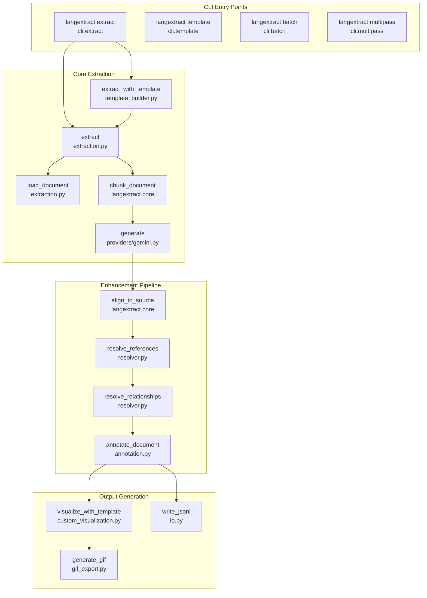
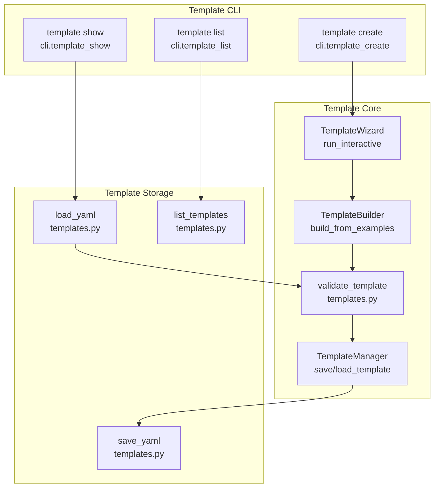
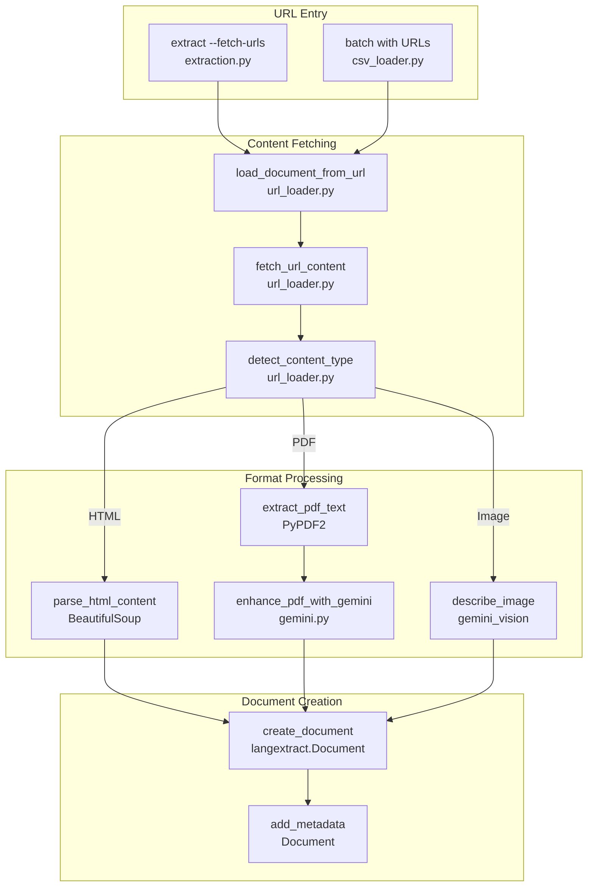
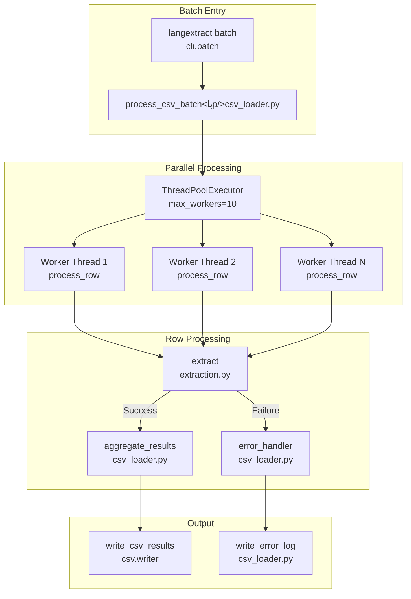
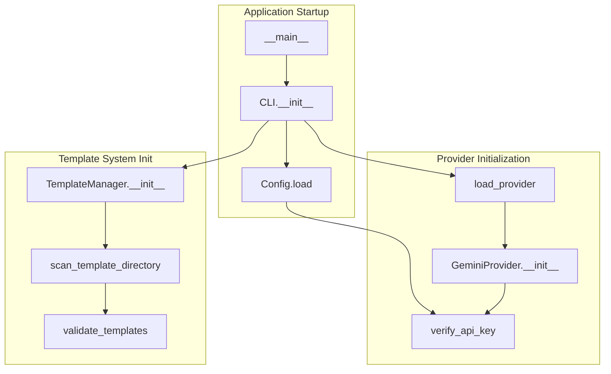
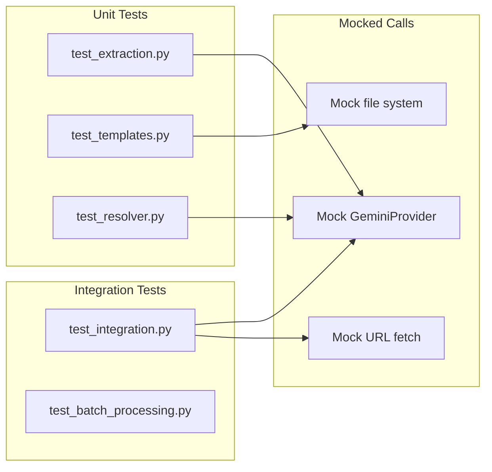

# Call Graph Documentation

## Entry Points and Call Chains

### CLI Commands



### Template Management Flow



### URL Processing Pipeline



### Batch Processing Flow



## Python API Call Chains

### Core Extraction API

```mermaid
graph TD
    subgraph "Public API"
        pub_extract[extract()<br/>Public API]
        pub_template[extract_with_template()<br/>Public API]
    end
    
    subgraph "Internal Core"
        validate_input[_validate_input]
        get_config[get_config]
        load_provider[load_provider]
        process_doc[_process_document]
    end
    
    subgraph "Provider Layer"
        gemini_init[GeminiProvider.__init__]
        gemini_gen[GeminiProvider.generate]
        retry_logic[retry_with_backoff]
    end
    
    subgraph "LangExtract Core"
        le_extract[langextract.extract]
        le_chunk[langextract.chunk]
        le_ground[langextract.ground]
    end
    
    pub_extract --> validate_input
    pub_extract --> get_config
    get_config --> load_provider
    load_provider --> gemini_init
    pub_extract --> process_doc
    process_doc --> le_extract
    le_extract --> le_chunk
    le_chunk --> gemini_gen
    gemini_gen --> retry_logic
    le_extract --> le_ground
    
    pub_template --> pub_extract
```

## Call Frequency Analysis

## High-Traffic Paths
These functions are called most frequently and are performance-critical:

| Function | Called By | Frequency | Cacheable |
|----------|-----------|-----------|-----------|
| `GeminiProvider.generate` | All extractions | Every chunk | No |
| `get_config` | All entry points | Every operation | Yes |
| `validate_template` | Template operations | Every template use | Yes |
| `chunk_document` | All extractions | Every document | No |
| `retry_with_backoff` | API failures | ~10% of requests | No |
| `resolve_references` | When --resolve-refs | Optional | Partial |

## Cross-Module Dependencies

## Module Interaction Matrix

| Caller → | extraction | templates | resolver | annotation | providers | visualization |
|----------|------------|-----------|----------|------------|-----------|---------------|
| **cli** | ✓ | ✓ | - | - | - | ✓ |
| **extraction** | - | ✓ | ✓ | ✓ | ✓ | - |
| **templates** | ✓ | - | - | - | - | - |
| **resolver** | - | - | - | - | - | - |
| **annotation** | - | - | ✓ | - | - | - |
| **providers** | - | - | - | - | - | - |
| **visualization** | - | ✓ | - | - | - | - |
| **csv_loader** | ✓ | - | - | - | - | - |
| **url_loader** | - | - | - | - | ✓ | - |

✓ = Direct function calls between modules

## Critical Call Paths

## Performance-Critical Paths

### Single Document Extraction
```
langextract extract -i doc.pdf -p "prompt"
  └── extract() [~5-15s total]
      ├── load_document (100ms)
      ├── chunk_document (50ms)
      ├── gemini_generate (2-10s) ← BOTTLENECK
      │   └── retry_with_backoff (if needed)
      ├── ground_extractions (200ms)
      ├── resolve_references (100ms)
      ├── annotate_document (50ms)
      └── generate_html (100ms)
```

### Template-Based Extraction
```
langextract extract -i doc.pdf -t invoice
  └── extract_with_template() [~5-15s total]
      ├── load_template (10ms) ← CACHED
      ├── validate_template (5ms)
      ├── generate_prompt (10ms)
      └── extract() [~5-15s]
          └── [same as above]
```

### Batch Processing Pipeline
```
langextract batch -c documents.csv
  └── process_csv_batch() [varies by size]
      ├── read_csv (varies)
      ├── ThreadPoolExecutor.map [parallel]
      │   └── process_row() × N
      │       └── extract() [5-15s each]
      ├── aggregate_results (O(n))
      └── write_csv (varies)
```

### URL Content Fetching
```
extract --fetch-urls https://example.com/doc
  └── load_document_from_url() [1-10s]
      ├── fetch_url_content (1-5s) ← NETWORK I/O
      ├── detect_content_type (1ms)
      ├── parse_html/extract_pdf (100ms-2s)
      ├── enhance_with_gemini (2-5s) ← For PDFs
      └── create_document (10ms)
```

## Recursive Patterns

## Recursive/Circular Dependencies

### Multi-Pass Extraction
```
multi_pass_extract(document, passes=[...])
  ├── extract(pass_1)
  │   └── adds context
  ├── extract(pass_2) 
  │   └── uses pass_1 context
  └── extract(pass_n)
      └── uses accumulated context
      
[Linear, not truly recursive]
```

### Reference Resolution Chain
```
resolve_references(extractions)
  └── find_candidate_referents()
      └── fuzzy_match()
          └── calculate_similarity()
              └── [No recursion - flat iteration]
```

## Dependency Hotspots

## Most Depended Upon Functions
Functions that would have highest impact if changed:

1. **extraction.extract**
   - Called by: CLI, API, templates, batch, multipass
   - Critical: Core functionality
   - Change impact: Very High

2. **providers/gemini.GeminiProvider.generate**
   - Called by: All extraction operations
   - Critical: LLM interface
   - Change impact: Very High

3. **config.get_config**
   - Called by: All modules
   - Critical: Configuration management
   - Change impact: High

4. **templates.TemplateManager.load_template**
   - Called by: Template operations, extraction
   - Critical: Template system
   - Change impact: Medium

5. **resolver.ReferenceResolver.resolve_references**
   - Called by: Enhancement pipeline
   - Critical: Optional enhancement
   - Change impact: Low

6. **langextract.core functions**
   - Called by: extraction.py wrapper
   - Critical: Core extraction engine
   - Change impact: Very High (external dependency)

## Call Chain Depth Analysis

## Maximum Call Depths

### Deepest Call Chain
```
CLI Command (Level 0)
  └── extract (Level 1)
      └── load_document (Level 2)
          └── load_from_url (Level 3)
              └── fetch_url_content (Level 4)
                  └── requests.get (Level 5)
```

### Typical Call Depth
- CLI to Result: 4-6 levels
- API to Result: 3-5 levels  
- Error handling adds: +2 levels (retry logic)
- Enhancement pipeline adds: +3 levels

## Initialization Call Graph



## Performance Bottlenecks

## Call Graph Bottlenecks

| Bottleneck | Location | Impact | Mitigation |
|------------|----------|--------|------------|
| Gemini API calls | `GeminiProvider.generate` | 2-10s per call | Batch requests, caching |
| URL fetching | `fetch_url_content` | 1-5s per URL | Async I/O, connection pool |
| PDF processing | `enhance_pdf_with_gemini` | 2-5s per PDF | Skip enhancement option |
| Large file chunking | `chunk_document` | O(n) memory | Streaming chunks |
| Template validation | `validate_template` | Called repeatedly | Cache validation results |

## Testing Call Paths

## Test Coverage Critical Paths



## Critical Path Summary

### Most Important Call Chains

1. **Document → Extraction → Result**
   ```
   extract() → chunk_document() → GeminiProvider.generate() → ground() → enhance() → output()
   ```
   Impact: Core functionality, every extraction uses this

2. **Template → Prompt → Extraction**
   ```
   load_template() → validate() → generate_prompt() → extract()
   ```
   Impact: Template system functionality

3. **Error → Retry → Recovery**
   ```
   API_call() → catch_error() → retry_with_backoff() → circuit_breaker() → fallback()
   ```
   Impact: System resilience

4. **Batch → Parallel → Aggregate**
   ```
   process_csv() → ThreadPool.map() → extract() × N → aggregate_results()
   ```
   Impact: Batch processing performance