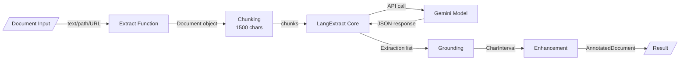
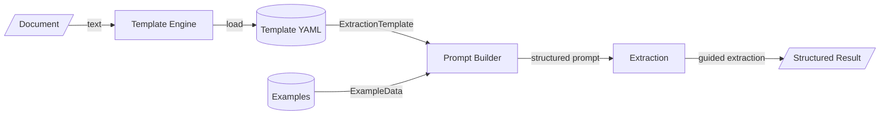
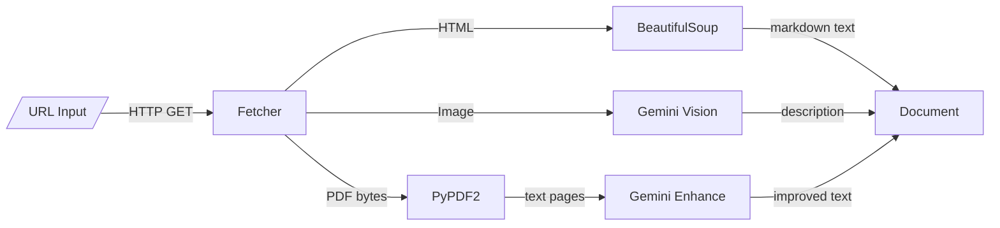
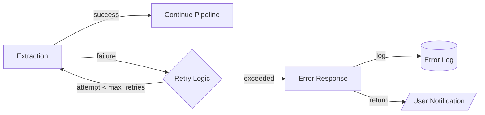

# LangExtract Extensions Data Flow

```mermaid
graph TD
    subgraph "Input Sources"
        PDF[/PDF File/]
        TEXT[/Text Document/]
        URL[/Web URL/]
        CSV[/CSV File/]
        CLI[/CLI Command/]
        API[/Python API Call/]
    end
    
    subgraph "Initial Processing"
        LOADER{Document<br/>Loader}
        URL_FETCH[URL Fetcher<br/>& Parser]
        PDF_EXTRACT[PDF Text<br/>Extractor]
        CSV_PARSE[CSV Parser]
    end
    
    subgraph "Template Layer"
        TEMPLATE_LOAD[(Template<br/>Storage)]
        TEMPLATE_BUILD[Template<br/>Builder]
        PROMPT_GEN[Prompt<br/>Generator]
    end
    
    subgraph "Core Extraction"
        CHUNKING[Document<br/>Chunking]
        LANGEXTRACT[LangExtract<br/>Core Engine]
        GEMINI[Gemini API<br/>Provider]
    end
    
    subgraph "Enhancement Pipeline"
        GROUNDING[Grounding<br/>Alignment]
        REF_RESOLVE[Reference<br/>Resolver]
        REL_RESOLVE[Relationship<br/>Resolver]
        ANNOTATOR[Quality<br/>Annotator]
        VERIFIER[Extraction<br/>Verifier]
    end
    
    subgraph "Multi-Pass"
        PASS_CONTROL{Pass<br/>Controller}
        PASS_MERGE[Result<br/>Merger]
    end
    
    subgraph "Output Generation"
        JSONL_WRITER[JSONL<br/>Serializer]
        HTML_GEN[HTML<br/>Generator]
        GIF_GEN[GIF<br/>Generator]
        CSV_WRITER[CSV<br/>Writer]
    end
    
    subgraph "Storage/Output"
        JSONL_FILE[(JSONL<br/>Files)]
        HTML_FILE[(HTML<br/>Files)]
        GIF_FILE[(GIF<br/>Files)]
        CSV_OUT[(CSV<br/>Results)]
        RESPONSE[/API/CLI<br/>Response/]
    end
    
    %% Input flows
    PDF -->|binary| LOADER
    TEXT -->|text| LOADER
    URL -->|URL string| URL_FETCH
    CSV -->|rows| CSV_PARSE
    CLI -->|args| LOADER
    API -->|params| LOADER
    
    %% Document loading
    LOADER -->|Document| CHUNKING
    URL_FETCH -->|HTML/text| PDF_EXTRACT
    URL_FETCH -->|text| LOADER
    PDF_EXTRACT -->|extracted text| LOADER
    CSV_PARSE -->|Document[]| CHUNKING
    
    %% Template flow
    LOADER -->|check template| TEMPLATE_LOAD
    TEMPLATE_LOAD -->|ExtractionTemplate| PROMPT_GEN
    TEMPLATE_BUILD -->|new template| TEMPLATE_LOAD
    PROMPT_GEN -->|prompt + examples| LANGEXTRACT
    
    %% Core extraction
    CHUNKING -->|text chunks| LANGEXTRACT
    LANGEXTRACT -->|generation request| GEMINI
    GEMINI -->|structured output| LANGEXTRACT
    LANGEXTRACT -->|Extraction[]| GROUNDING
    
    %% Enhancement pipeline
    GROUNDING -->|aligned extractions| REF_RESOLVE
    REF_RESOLVE -->|resolved refs| REL_RESOLVE
    REL_RESOLVE -->|with relationships| ANNOTATOR
    ANNOTATOR -->|quality scores| VERIFIER
    VERIFIER -->|AnnotatedDocument| JSONL_WRITER
    
    %% Multi-pass flow
    CHUNKING -->|multi-pass config| PASS_CONTROL
    PASS_CONTROL -->|pass 1| LANGEXTRACT
    PASS_CONTROL -->|pass 2| LANGEXTRACT
    PASS_CONTROL -->|pass n| LANGEXTRACT
    LANGEXTRACT -->|pass results| PASS_MERGE
    PASS_MERGE -->|merged extractions| GROUNDING
    
    %% Output generation
    JSONL_WRITER -->|JSONL data| JSONL_FILE
    JSONL_FILE -->|read| HTML_GEN
    JSONL_FILE -->|read| GIF_GEN
    HTML_GEN -->|HTML string| HTML_FILE
    GIF_GEN -->|GIF binary| GIF_FILE
    VERIFIER -->|structured data| CSV_WRITER
    CSV_WRITER -->|CSV rows| CSV_OUT
    
    %% Response flows
    HTML_FILE -->|file path| RESPONSE
    JSONL_FILE -->|results| RESPONSE
    CSV_OUT -->|batch results| RESPONSE
```

## Detailed Data Flow Descriptions

### Primary Extraction Flow


### Template-Based Flow


### URL Processing Flow


## Data Transformations

### Input Transformations
| Stage | Input Format | Output Format | Transformation |
|-------|-------------|---------------|----------------|
| URL Fetch | URL string | HTML/PDF/Image | HTTP GET request |
| PDF Extract | PDF binary | Plain text | PyPDF2 extraction + Gemini enhancement |
| HTML Parse | HTML | Markdown | BeautifulSoup cleaning |
| CSV Load | CSV rows | Document[] | Column mapping |

### Core Processing Transformations
| Stage | Input | Output | Transformation |
|-------|-------|--------|----------------|
| Chunking | Document text | Text chunks | Split by max_char_buffer (1500) |
| Prompt Generation | Template + Examples | Structured prompt | Template interpolation |
| LangExtract | Prompt + Text | Raw extractions | LLM extraction |
| Grounding | Extractions | Aligned extractions | Fuzzy matching to source |

### Enhancement Transformations
| Stage | Input | Output | Transformation |
|-------|-------|--------|----------------|
| Reference Resolution | Extractions + Text | Resolved extractions | Pronoun/abbreviation linking |
| Relationship Detection | Extractions | Relationships | Proximity-based association |
| Quality Scoring | Extraction | Score (0-1) | Confidence calculation |
| Annotation | Extraction | Annotations | Verification + metadata |

### Output Transformations
| Stage | Input | Output | Transformation |
|-------|-------|--------|----------------|
| JSONL Serialization | AnnotatedDocument | JSONL lines | JSON encoding per document |
| HTML Generation | JSONL + Template | HTML string | Template rendering with grounding |
| GIF Creation | JSONL frames | GIF binary | Frame generation + animation |
| CSV Writing | Extractions | CSV rows | Tabular flattening |

## Data Volume & Performance

### Typical Data Sizes
- **Input Documents**: 1KB - 10MB (PDFs)
- **Text Chunks**: 1500 characters per chunk
- **Extractions per Document**: 10-100 items
- **JSONL Output**: 5-50KB per document
- **HTML Visualization**: 100-500KB with embedded data

### Processing Times
- **PDF Extraction**: 1-5 seconds per page
- **URL Fetching**: 1-10 seconds (with Gemini processing)
- **Core Extraction**: 2-10 seconds per document
- **Reference Resolution**: <1 second
- **HTML Generation**: <1 second

### Bottlenecks
- **Gemini API Calls**: Rate limited by tier
- **Multi-Pass**: Linear time increase (n passes)
- **Batch Processing**: Limited by max_workers (default: 10)

## Data Consistency

### Transaction Boundaries
- **Extraction**: Atomic per document
- **Template Operations**: File-based atomic writes
- **Batch Processing**: Independent per document
- **Multi-Pass**: All passes must complete

### Eventual Consistency Points
- **Template Updates**: Changes apply to next extraction
- **Config Updates**: Global config affects new operations
- **Reference Resolution**: Post-processing, not guaranteed

### Data Synchronization
- **No distributed state**: All processing in-memory
- **File-based persistence**: JSONL/YAML/HTML files
- **Stateless operations**: Each extraction independent

## Error Handling

### Failed Record Handling


### Retry Mechanisms
- **API Retries**: max_retries config (default: 3)
- **Exponential Backoff**: retry_delay * attempt
- **URL Fetch Timeout**: 30 seconds default
- **Batch Processing**: Skip failed, continue others

### Error Recovery Paths
- **Invalid Template**: Fall back to direct prompt
- **API Key Missing**: Clear error message
- **Extraction Failure**: Return partial results
- **URL Unreachable**: Timeout and error
- **PDF Corruption**: Attempt text extraction anyway

## Critical Data Paths

### Real-time Extraction Path
```
User Input → Validation → Template/Prompt → LangExtract → 
Gemini API → Grounding → Enhancement → Response (5-15 seconds)
```

### Batch Processing Path
```
CSV Input → Parallel Workers → Individual Extractions → 
Aggregation → CSV Output (varies by size)
```

### Template Creation Path
```
Examples → Template Builder → Field Inference → 
Optimization → YAML Storage → Ready for use
```

## Data Retention

### Persistent Storage
- **Templates**: Stored indefinitely in YAML/JSON
- **JSONL Results**: Kept until user deletes
- **HTML Visualizations**: Static files, no expiry
- **Config Files**: Persistent user settings

### Temporary Data
- **In-memory Documents**: Garbage collected
- **API Responses**: Not cached
- **Intermediate Extractions**: Discarded after enhancement

### No Data Storage
- **User Documents**: Not retained after processing
- **API Keys**: Never stored, only in environment
- **Personal Information**: No tracking or storage