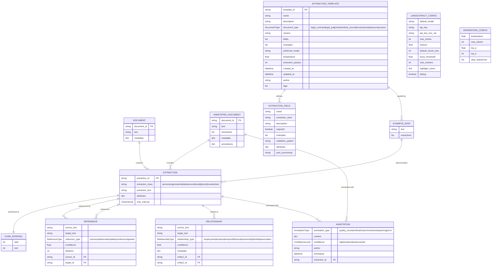
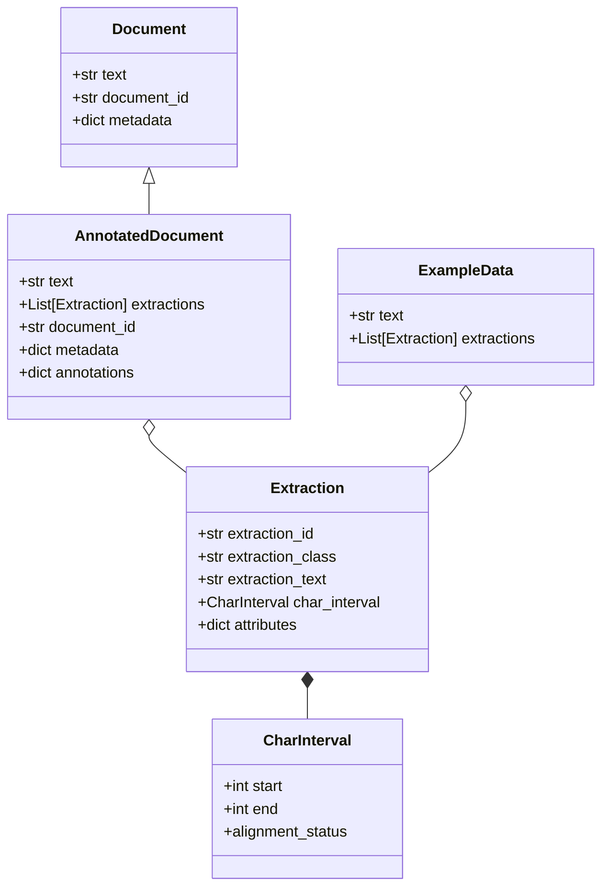

# LangExtract Extensions Data Models



## Additional Data Model Details

### Core Data Classes (from langextract.data)



## Data Constraints

### Template Constraints
- **template_id** must be unique across all templates
- **preferred_model** defaults to "gemini-2.5-flash-thinking"
- **temperature** range: 0.0 to 2.0 (default: 0.3)
- **extraction_passes** typically 1-3 (default: 1)
- **document_type** determines available built-in templates

### Extraction Constraints
- **extraction_class** determines validation rules and post-processing
- **char_interval** provides exact grounding in source text (nullable for generated text)
- **attributes** store extraction-specific metadata (e.g., amount: {currency: "USD", type: "principal"})

### Reference/Relationship Constraints
- **confidence** range: 0.0 to 1.0
- **distance** measured in characters between entities
- References must link existing extractions
- Relationships require proximity threshold (default: 100 chars)

### Annotation Constraints
- Each extraction can have multiple annotations
- **confidence_level** affects quality scoring
- **author** tracks annotation source (system/user/model)

## Data Types Notes

### JSON/Dict Fields

**metadata** (Document, AnnotatedDocument):
```json
{
  "source_url": "https://...",
  "content_type": "application/pdf",
  "processed_date": "2025-01-01",
  "page_count": 5
}
```

**attributes** (Extraction):
```json
{
  "role": "plaintiff",
  "currency": "USD",
  "medication_group": "group_1",
  "confidence": 0.95
}
```

**content** (Annotation):
```json
{
  "score": 0.85,
  "reason": "High confidence match",
  "verified": true,
  "issues": ["date format unclear"]
}
```

### Enum Values

**extraction_class**:
- `person`: Individual names
- `organization`: Companies, institutions
- `date`: Temporal references
- `amount`: Monetary values
- `email`: Email addresses
- `phone`: Phone numbers
- `location`: Places, addresses
- `text`: Generic text extraction
- Custom classes supported via templates

**DocumentType**:
- `legal_contract`: Legal agreements
- `legal_judgment`: Court judgments
- `medical_record`: Patient records
- `medical_report`: Medical reports
- `financial_statement`: Financial docs
- `invoice`: Billing documents
- `receipt`: Purchase receipts
- `resume`: CVs/resumes
- `research_paper`: Academic papers
- `news_article`: News content
- `email`: Email messages
- `form`: Forms/applications
- `custom`: User-defined

## Data Flow Context

### Creation Flow
1. **Document** → Created from file/URL/text input
2. **Extraction** → Generated by LangExtract core or enhanced extraction
3. **CharInterval** → Computed by grounding algorithm
4. **Reference** → Created by ReferenceResolver post-processing
5. **Relationship** → Created by RelationshipResolver analysis
6. **Annotation** → Added by ExtractionAnnotator for quality/verification

### Template Flow
1. **ExtractionTemplate** → Created via CLI wizard or TemplateBuilder
2. **ExtractionField** → Defined manually or inferred from examples
3. **ExampleData** → Provided by user or generated from existing extractions

### Persistence
- **Templates**: Stored as YAML/JSON files in templates directory
- **Extractions**: Saved as JSONL files for visualization
- **Config**: Stored in .langextract.yaml or environment
- **Annotations**: Embedded in AnnotatedDocument or exported separately

### Data Lifecycle
- **Documents**: Transient, created per extraction request
- **Extractions**: Persisted in JSONL for visualization/analysis
- **Templates**: Long-lived, versioned, reusable
- **References/Relationships**: Generated per extraction, not persisted
- **Annotations**: Can be persisted with documents or separately

## Key Business Rules

1. **Grounding Requirement**: Every extraction should have char_interval for source attribution
2. **Template Reusability**: Templates are designed to be shared across similar document types
3. **Reference Resolution**: Only resolves within max_distance threshold (default: 500 chars)
4. **Relationship Detection**: Requires proximity_threshold (default: 100 chars)
5. **Quality Scoring**: Based on grounding alignment, extraction confidence, and validation rules
6. **Model Selection**: Templates can override global default model
7. **API Key**: Must be set via GOOGLE_API_KEY environment variable
8. **Batch Processing**: CSV loader processes documents in parallel (max_workers)