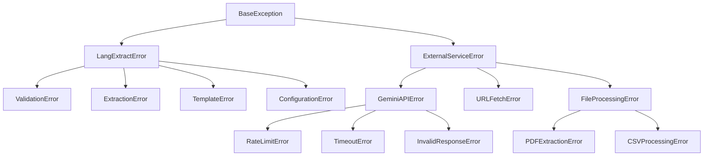
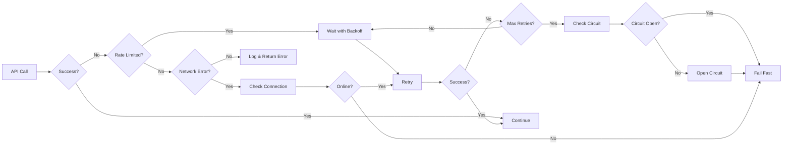
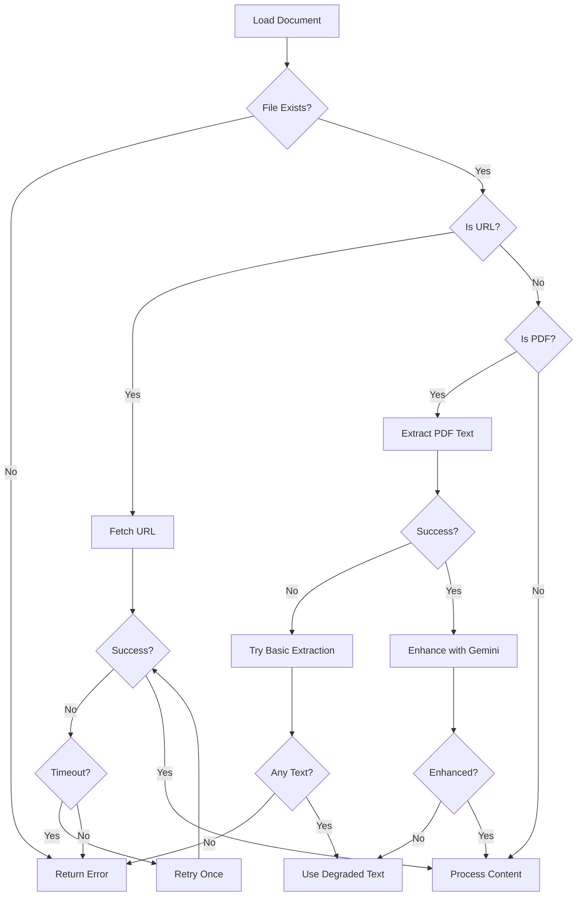
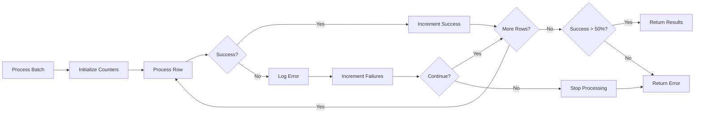

# Error Handling Documentation

## Error Hierarchy



## Error Handling Layers

### 1. Configuration Layer
```python
# Location: config.py
# Catches: Missing API keys, invalid configuration

ConfigurationError:
  - Exit Code: 1
  - User Message: Clear configuration instructions
  - Log Level: ERROR
  - Example: "Error: GOOGLE_API_KEY environment variable not set"
  - Recovery: None - user must set configuration
  
APIKeyError:
  - Exit Code: 1
  - User Message: "GOOGLE_API_KEY not found in environment"
  - Log Level: ERROR
  - Recovery: Check alternate locations (.env file)
  - Note: Never logs the actual key value
```

### 2. Input Validation Layer
```python
# Location: extraction.py, templates.py
# Catches: Invalid input files, malformed templates

ValidationError:
  - Exit Code: 2
  - User Message: Specific validation errors
  - Log Level: WARNING
  - Example: "Template 'invoice' not found"
  - Recovery: Fall back to prompt-only extraction

FileNotFoundError:
  - Exit Code: 2
  - User Message: "File not found: {path}"
  - Log Level: INFO
  - Example: "document.pdf not found"
  - Recovery: None - user must provide valid file
```

### 3. External Service Layer
```python
# Location: providers/gemini.py, url_loader.py
# Catches: API failures, network issues

GeminiAPIError:
  - Exit Code: 3
  - User Message: "Model API temporarily unavailable"
  - Log Level: ERROR
  - Recovery: Retry with exponential backoff
  - Fallback: Return partial results if available
  - Circuit Breaker: Opens after 3 consecutive failures

RateLimitError:
  - Exit Code: 3
  - User Message: "API rate limit reached. Please wait and retry."
  - Log Level: WARNING
  - Recovery: Exponential backoff (2s, 4s, 8s)
  - Max Retries: 3
  - Headers Checked: X-RateLimit-Remaining
```

### 4. Processing Layer
```python
# Location: extraction.py, csv_loader.py
# Catches: Processing failures, parsing errors

ExtractionError:
  - Exit Code: 4
  - User Message: "Failed to extract information from document"
  - Log Level: ERROR
  - Recovery: Retry with different chunk size
  - Fallback: Return any successful chunk extractions

JSONParseError:
  - Exit Code: 4
  - User Message: "Invalid response from model"
  - Log Level: ERROR
  - Recovery: Attempt JSON repair
  - Fallback: Request regeneration with stricter prompt
```

## Retry Strategies

### Exponential Backoff for Gemini API
```markdown
Used for: Gemini API calls, rate limiting
Pattern: 2s → 4s → 8s → 16s (max 3 attempts by default)

```python
def retry_with_backoff(func, max_retries=3, initial_delay=2):
    delay = initial_delay
    for attempt in range(max_retries):
        try:
            return func()
        except (RateLimitError, TimeoutError) as e:
            if attempt == max_retries - 1:
                raise
            logger.warning(f"Attempt {attempt + 1} failed: {e}")
            time.sleep(delay)
            delay *= 2
```

Configuration:
- max_retries: 3 (configurable)
- initial_delay: 2 seconds
- max_delay: 16 seconds
- retry_on: [429, 503, timeout]
```

### Circuit Breaker for External Services
```markdown
Used for: Protecting Gemini API, URL fetching
States: Closed → Open → Half-Open

- Closed: Normal operation
- Open: All calls fail fast (after 3 consecutive failures)
- Half-Open: Test with single request after 60s

Thresholds:
- failure_threshold: 3 consecutive failures
- success_threshold: 2 consecutive successes (to close)
- timeout: 60 seconds (before half-open)

Fallback: 
- Return cached results if available
- Use simpler model (fallback from pro to flash)
- Return partial extractions
```

### Batch Processing Error Handling
```markdown
Used for: CSV processing, multi-document extraction
Strategy: Continue on individual failures

Error Tolerance:
- Skip failed rows, continue processing
- Log errors to separate error file
- Provide summary: "95 successful, 5 failed"
- Success threshold: >50% must succeed

Recovery:
- Retry failed items separately
- Reduce batch size on memory errors
- Fall back to sequential processing
```

## Error Response Format

### CLI Error Output
```bash
# Configuration Error
Error: GOOGLE_API_KEY environment variable not set
Please set your API key: export GOOGLE_API_KEY=your_key_here

# File Not Found
Error: File not found: /path/to/document.pdf
Please check the file path and try again.

# Extraction Failure
Error: Extraction failed: API rate limit exceeded
Retrying in 2 seconds... (attempt 1/3)
Retrying in 4 seconds... (attempt 2/3)
Error: Maximum retries exceeded. Please try again later.

# Partial Success
Warning: Partial extraction completed (3 of 5 chunks processed)
See error log for details: errors.log
```

### Python API Error Response
```python
# Custom Exception Classes
class LangExtractError(Exception):
    """Base exception for all LangExtract errors"""
    def __init__(self, message, error_code=None, details=None):
        self.message = message
        self.error_code = error_code
        self.details = details or {}
        super().__init__(self.message)

# Error Response Object
{
    "success": False,
    "error": {
        "type": "RateLimitError",
        "message": "API rate limit exceeded",
        "code": "RATE_LIMIT_429",
        "details": {
            "retry_after": 60,
            "limit": 100,
            "remaining": 0
        },
        "timestamp": "2025-01-20T10:30:00Z"
    },
    "partial_results": [...]  # If any
}
```

### User-Facing Error Messages
```markdown
| Error Type | Internal Message | User Message |
|------------|------------------|--------------|
| Missing API Key | "os.environ['GOOGLE_API_KEY'] is None" | "Please set GOOGLE_API_KEY environment variable" |
| Invalid Model | "Model gemini-2.5-ultra not found" | "Invalid model. Using default: gemini-2.5-flash-thinking" |
| PDF Corruption | "PyPDF2.PdfReadError: EOF marker not found" | "PDF file appears to be corrupted" |
| Network Timeout | "requests.Timeout after 30s" | "Network request timed out. Please check your connection" |
| Invalid JSON | "json.JSONDecodeError at line 1" | "Model returned invalid response. Retrying..." |
| Template Missing | "FileNotFoundError: invoice.yaml" | "Template 'invoice' not found. Using direct prompt instead" |
```

## Error Recovery Flows

### Gemini API Failure Recovery


### Document Processing Error Recovery


### Batch Processing Error Handling


## Monitoring & Alerting

### Error Logging
```markdown
| Level | What Gets Logged | Destination | Retention |
|-------|------------------|-------------|-----------|
| ERROR | API failures, extraction errors | stderr + file | 30 days |
| WARNING | Retries, fallbacks, partial success | stderr + file | 7 days |
| INFO | User errors, validation | file only | 24 hours |
| DEBUG | Full stack traces, request details | file only (if enabled) | 1 day |

Context Included:
- Timestamp (ISO 8601)
- Error type and code
- File/URL being processed
- Model being used
- Retry attempt number
- Chunk index (if applicable)
- NOT logged: API keys, document content
```

### Error Metrics Tracked
```markdown
| Metric | Threshold | Action |
|--------|-----------|--------|
| API Error Rate | >10% | Log warning |
| Retry Rate | >25% | Review rate limits |
| Extraction Failures | >5% | Check model/prompts |
| Timeout Rate | >15% | Increase timeout |
| Circuit Opens | Any | Manual investigation |
```

### Health Checks
```python
# Health check endpoint for monitoring
def health_check():
    checks = {
        "api_key_configured": bool(os.environ.get("GOOGLE_API_KEY")),
        "gemini_api_accessible": test_gemini_connection(),
        "template_dir_writable": test_template_directory(),
        "last_extraction_time": get_last_extraction_timestamp(),
        "error_rate_1h": calculate_error_rate(hours=1)
    }
    
    if not checks["api_key_configured"]:
        return {"status": "unhealthy", "reason": "No API key"}
    if checks["error_rate_1h"] > 0.1:
        return {"status": "degraded", "errors": checks["error_rate_1h"]}
    return {"status": "healthy", "checks": checks}
```

## Error Prevention Strategies

### Input Validation
```python
# Validate before processing
def validate_input(file_path, prompt, template):
    errors = []
    
    if not os.path.exists(file_path):
        errors.append(f"File not found: {file_path}")
    
    if not prompt and not template:
        errors.append("Either prompt or template required")
    
    if template and not template_exists(template):
        errors.append(f"Template not found: {template}")
    
    if errors:
        raise ValidationError(errors)
```

### Resource Limits
```markdown
Enforced Limits:
- Max file size: 50MB
- Max URL content: 10MB
- Max chunks per document: 100
- Max concurrent workers: 20
- Max retry attempts: 3
- Request timeout: 60 seconds
```

### Graceful Degradation
```markdown
Fallback Chain:
1. Primary: gemini-2.5-pro with full features
2. Fallback 1: gemini-2.5-flash-thinking (on pro failure)
3. Fallback 2: gemini-2.5-flash (on thinking failure)
4. Fallback 3: Return partial results
5. Final: Return cached results if available
```

## Common Error Scenarios

### Scenario 1: API Key Not Set
```bash
$ langextract extract -i doc.pdf -p "Extract data"
Error: GOOGLE_API_KEY environment variable not set

Please set your Google API key:
  export GOOGLE_API_KEY=your_api_key_here

For more information, see:
  https://makersuite.google.com/app/apikey
```

### Scenario 2: Rate Limit Exceeded
```bash
$ langextract batch -c large_dataset.csv
Processing batch: 0%|          | 0/1000
Warning: Rate limit approaching (90/100 requests)
Slowing down request rate...
Error: Rate limit exceeded at row 95
Waiting 60 seconds before retry...
Resuming from row 95...
Processing batch: 100%|████████| 1000/1000
Completed with 5 retries due to rate limiting
```

### Scenario 3: Partial Extraction Success
```bash
$ langextract extract -i corrupted.pdf --template invoice
Warning: PDF appears to be corrupted
Attempting basic text extraction...
Partial extraction completed (60% of document processed)
Results saved to: results_partial.html
Error details logged to: extraction_errors.log
```

### Scenario 4: Network Timeout
```bash
$ langextract extract -i https://example.com/doc --fetch-urls
Fetching content from URL...
Error: Connection timeout after 30 seconds
Retrying (attempt 1/3)...
Error: Connection timeout after 30 seconds
Retrying (attempt 2/3)...
Success: Content fetched (45 seconds)
Extraction completed successfully
```

## Error Codes Reference

```markdown
| Code | Type | Description | User Action |
|------|------|-------------|-------------|
| E001 | Config | Missing API key | Set GOOGLE_API_KEY |
| E002 | Config | Invalid model specified | Use supported model |
| E003 | Input | File not found | Check file path |
| E004 | Input | Invalid template | Check template name |
| E005 | Network | URL fetch timeout | Check URL/connection |
| E006 | API | Rate limit exceeded | Wait and retry |
| E007 | API | Invalid API response | Report issue |
| E008 | Process | Extraction failed | Check document format |
| E009 | Process | PDF extraction error | Try different PDF |
| E010 | Process | CSV processing error | Check CSV format |
```