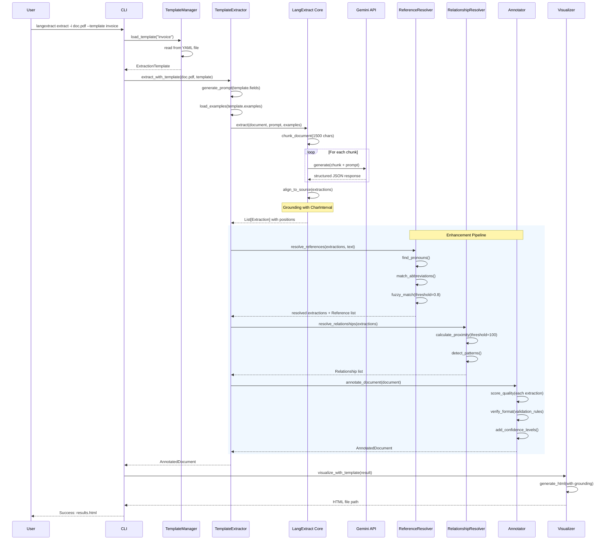
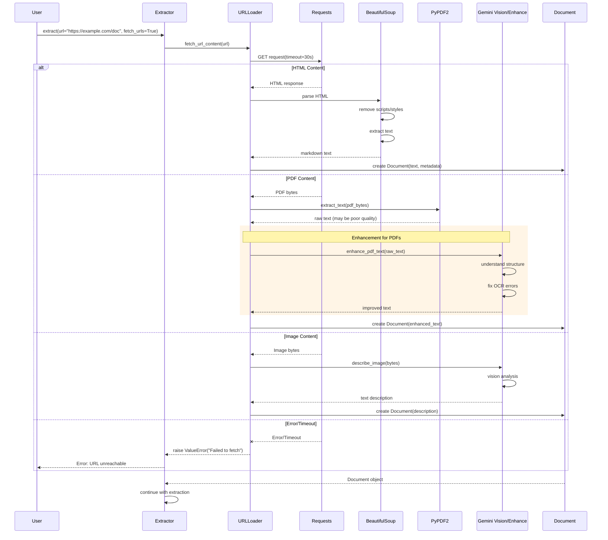
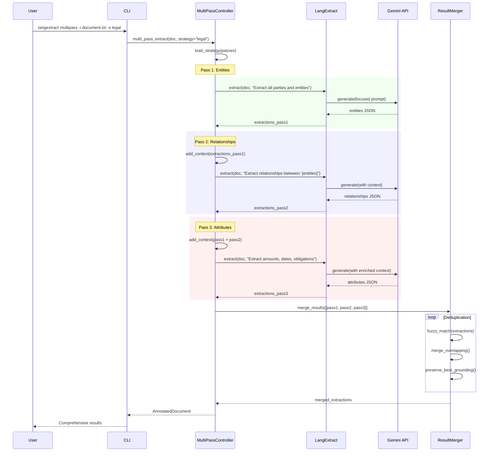
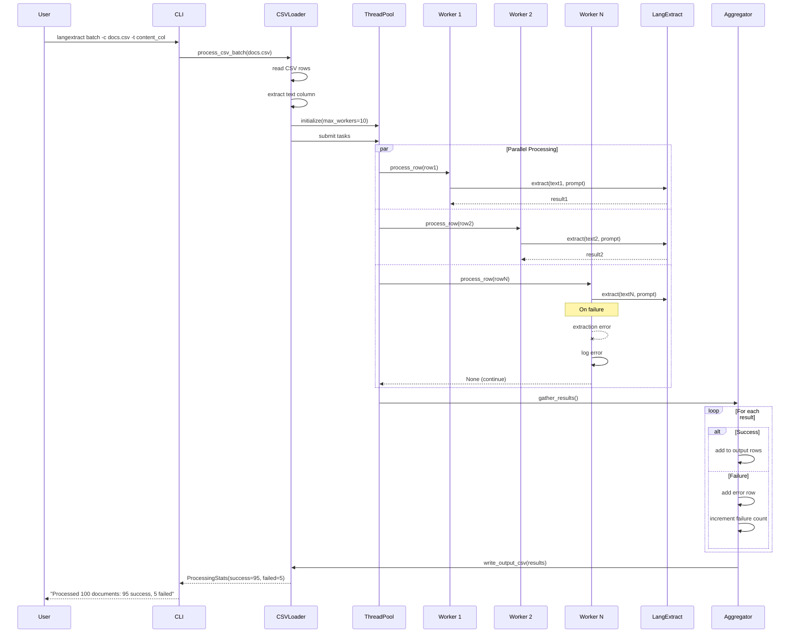
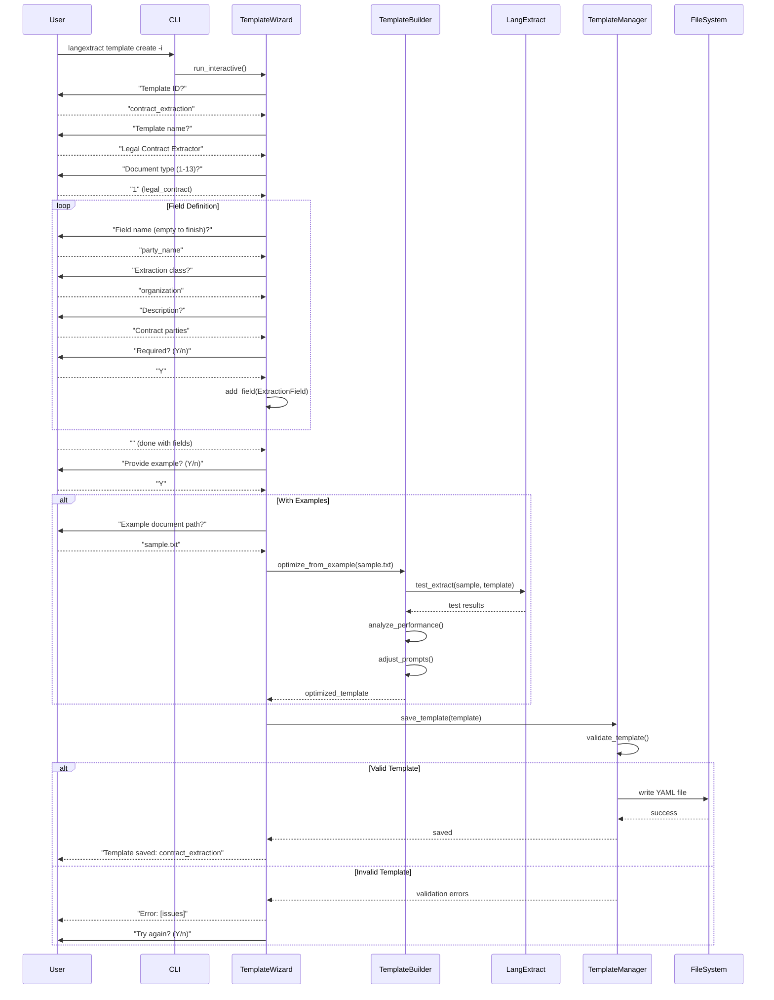

# LangExtract Extensions Sequence Diagrams

## 1. Template-Based Extraction with Enhancement Pipeline
**Trigger:** User requests extraction using a template
**Outcome:** Structured extractions with grounding, resolved references, and quality annotations



### Performance Notes
- Template loading: <100ms (cached after first load)
- Extraction: 2-10s depending on document size
- Gemini API calls: Main bottleneck (1-3s per chunk)
- Enhancement pipeline: <1s total
- HTML generation: <500ms

### Failure Modes
- Template not found → Fall back to prompt-only extraction
- Gemini API timeout → Retry with exponential backoff (max 3 attempts)
- Invalid document → Clear error message to user
- Reference resolution failure → Continue without references

---

## 2. URL Content Fetching with Multi-Format Processing
**Trigger:** User provides URL for extraction
**Outcome:** Processed document ready for extraction



### Performance Notes
- HTML fetching: 1-5s depending on page size
- PDF processing: 2-10s (enhanced with Gemini)
- Image analysis: 3-5s (Gemini Vision)
- Timeout: 30s default

### Failure Modes
- Network timeout → ValueError with clear message
- Invalid content type → Attempt text extraction anyway
- PDF corruption → Fall back to basic text extraction
- Rate limiting → Retry with backoff

---

## 3. Multi-Pass Extraction Strategy
**Trigger:** Complex document requiring iterative extraction
**Outcome:** Comprehensive extractions from multiple focused passes



### Performance Notes
- Linear time increase: O(n) where n = number of passes
- Each pass: 2-5s
- Total for 3 passes: 6-15s
- Merging overhead: <500ms

### Failure Modes
- Pass failure → Continue with remaining passes
- No extractions in pass → Skip to next
- Merge conflicts → Keep extraction with better grounding

---

## 4. Batch CSV Processing with Parallel Workers
**Trigger:** CSV file with multiple documents to process
**Outcome:** Parallel extraction with aggregated results



### Performance Notes
- Parallel speedup: Near-linear up to max_workers
- Throughput: ~1-2 documents/second/worker
- Memory: Scales with max_workers * chunk_size
- CSV writing: Streaming (low memory)

### Failure Modes
- Individual row failure → Log and continue
- Worker crash → ThreadPool handles, continues with others
- Memory exhaustion → Reduce max_workers
- API rate limiting → Automatic backoff per worker

---

## 5. Interactive Template Creation Wizard
**Trigger:** User wants to create custom extraction template
**Outcome:** New template saved and ready for use



### Performance Notes
- Interactive prompts: Instant
- Template optimization: 5-10s if testing with examples
- File I/O: <100ms
- Total wizard time: 1-3 minutes user time

### Failure Modes
- Invalid field configuration → Prompt for correction
- Example extraction fails → Continue without optimization
- File write permission error → Try alternate location
- Duplicate template ID → Prompt for new ID

---

## 6. Error Handling and Recovery Flow
**Trigger:** Extraction failure at any point
**Outcome:** Graceful degradation or recovery

```mermaid
sequenceDiagram
    participant User
    participant Ext as Extractor
    participant LE as LangExtract
    participant Gemini as Gemini API
    participant Config as Configuration
    participant Logger as ErrorLogger
    
    User->>Ext: extract(document, prompt)
    
    Ext->>Config: get_api_key()
    
    alt No API Key
        Config-->>Ext: None
        Ext-->>User: Error: GOOGLE_API_KEY not set
    else API Key Present
        Ext->>LE: extract()
        LE->>Gemini: generate()
        
        alt Success
            Gemini-->>LE: response
            LE-->>Ext: extractions
            Ext-->>User: results
        else Rate Limited
            Gemini--xLE: 429 Too Many Requests
            
            rect rgb(255, 245, 230)
                Note over LE: Retry with backoff
                loop retry < max_retries
                    LE->>LE: wait(2^retry seconds)
                    LE->>Gemini: generate()
                    alt Success
                        Gemini-->>LE: response
                        break
                    else Still Limited
                        Gemini--xLE: 429
                    end
                end
            end
            
            alt Retries Exhausted
                LE->>Logger: log_error(rate_limit)
                LE-->>Ext: RateLimitError
                Ext-->>User: "API rate limit. Try again later"
            end
        else Network Error
            Gemini--xLE: Connection Error
            LE->>Logger: log_error(network)
            
            alt Partial Results Available
                LE->>LE: return_partial_results()
                LE-->>Ext: partial extractions
                Ext-->>User: "Warning: Partial results due to error"
            else No Results
                LE-->>Ext: ConnectionError
                Ext-->>User: "Network error. Check connection"
            end
        else Invalid Response
            Gemini-->>LE: Malformed JSON
            LE->>Logger: log_error(parse_error)
            LE->>LE: attempt_repair_json()
            
            alt Repair Success
                LE-->>Ext: repaired extractions
            else Repair Failed
                LE-->>Ext: ParseError
                Ext-->>User: "Invalid model response"
            end
        end
    end
```

### Performance Notes
- Retry delays: 2, 4, 8 seconds (exponential)
- Timeout per request: 60s default
- Partial result assembly: <100ms
- Error logging: Async, non-blocking

### Failure Modes
- API key missing → Immediate clear error
- Rate limiting → Automatic retry with backoff
- Network issues → Partial results if possible
- Parse errors → Attempt JSON repair
- Catastrophic failure → Detailed error log for debugging

---

## Summary of Critical Flows

1. **Template-Based Extraction**: Most complex flow with 8+ components
2. **URL Processing**: Multi-format handling with enhancement
3. **Multi-Pass Strategy**: Iterative refinement pattern
4. **Batch Processing**: Parallel worker coordination
5. **Template Creation**: Interactive user flow with validation
6. **Error Recovery**: Comprehensive failure handling

### Key Patterns
- **Enhancement Pipeline**: Sequential processing (extract → resolve → annotate)
- **Parallel Processing**: ThreadPool for batch operations
- **Retry Logic**: Exponential backoff for transient failures
- **Graceful Degradation**: Partial results when possible
- **Interactive Flows**: Step-by-step user guidance with validation