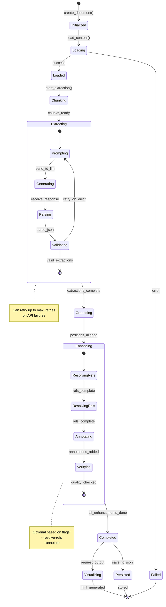
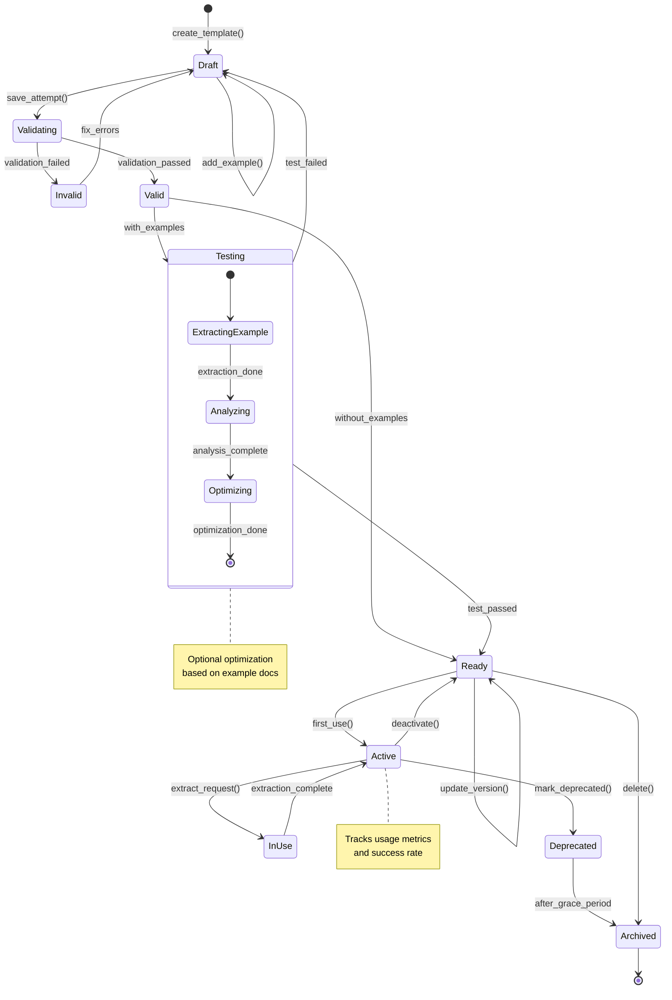

# LangExtract Extensions State Machines

## 1. Extraction Pipeline State Machine
**Context:** Controls the multi-stage extraction and enhancement process
**State Storage:** In-memory during processing, JSONL for persistence



### States

- **Initialized**: Document object created, no content yet
- **Loading**: Fetching content from file/URL
- **Loaded**: Content ready for processing
- **Chunking**: Splitting document into processable chunks
- **Extracting**: Core extraction via LLM (nested state machine)
  - **Prompting**: Building prompt with examples
  - **Generating**: Waiting for LLM response
  - **Parsing**: Processing JSON response
  - **Validating**: Checking extraction format
- **Grounding**: Aligning extractions to source text
- **Enhancing**: Post-processing pipeline (nested state machine)
  - **ResolvingRefs**: Pronoun/abbreviation resolution
  - **ResolvingRels**: Relationship detection
  - **Annotating**: Quality scoring
  - **Verifying**: Validation checks
- **Completed**: All processing done, ready for output
- **Visualizing**: Generating HTML/GIF output
- **Persisted**: Saved to storage
- **Failed**: Unrecoverable error occurred

### Transition Guards

- `load_content()`: Valid file path or URL
- `start_extraction()`: Document has text content
- `chunks_ready`: chunk_size > 0 and text length > 0
- `send_to_llm`: Valid API key and prompt
- `retry_on_error`: retry_count < max_retries
- `request_output`: Output format specified

### Transition Actions

- `Initialized → Loading`: Initialize loaders based on input type
- `Loading → Failed`: Log error, return error message
- `Chunking → Extracting`: Create chunk array with overlaps
- `Generating → Parsing`: Track API usage metrics
- `Grounding → Enhancing`: Calculate grounding confidence scores
- `Completed → Visualizing`: Load appropriate template
- `Completed → Persisted`: Write JSONL with metadata

### Timeout Behaviors

- **Loading**: 30 second timeout for URL fetching
- **Generating**: 60 second timeout per LLM call
- **Extracting**: Total timeout = timeout * number_of_chunks

---

## 2. Template Lifecycle State Machine
**Context:** Manages template creation, validation, and usage
**State Storage:** YAML files in templates directory



### States

- **Draft**: Template being created/edited, not saved
- **Validating**: Checking template structure and rules
- **Invalid**: Failed validation, needs fixes
- **Valid**: Passed validation, structure correct
- **Testing**: Running test extractions with examples
  - **ExtractingExample**: Processing example document
  - **Analyzing**: Comparing to expected output
  - **Optimizing**: Adjusting prompts/parameters
- **Ready**: Available for use, not yet used
- **Active**: Has been used at least once
- **InUse**: Currently being used for extraction
- **Deprecated**: Marked for removal, still functional
- **Archived**: Backed up but not available

### Transition Guards

- `save_attempt()`: All required fields present
- `validation_passed`: Fields valid, examples parseable
- `with_examples`: len(examples) > 0
- `test_passed`: extraction accuracy > threshold
- `first_use()`: Template file exists
- `mark_deprecated()`: Admin permission
- `after_grace_period`: 30 days since deprecation

### Transition Actions

- `Draft → Validating`: Check field types and patterns
- `Testing → Ready`: Store optimization results
- `Ready → Active`: Initialize usage counter
- `Active → InUse`: Lock template (read-only)
- `InUse → Active`: Update success metrics
- `Active → Deprecated`: Send notifications to users
- `* → Archived`: Move to backup directory

---

## 3. Batch Processing Job State Machine
**Context:** Manages CSV batch processing lifecycle
**State Storage:** In-memory job tracker, results in CSV

```mermaid
stateDiagram-v2
    [*] --> Queued: submit_batch()
    
    Queued --> Preparing: worker_available
    
    Preparing --> Ready: validation_passed
    Preparing --> Failed: invalid_input
    
    Ready --> Processing: start_processing()
    
    state Processing {
        [*] --> Distributing
        Distributing --> Running: tasks_assigned
        
        state Running {
            --
            [*] --> Working
            Working --> Working: process_row
            Working --> [*]: all_rows_done
            --
        }
        
        Running --> Aggregating: all_workers_done
        Aggregating --> [*]: results_merged
    }
    
    Processing --> Completed: success
    Processing --> PartiallyCompleted: some_failures
    Processing --> Failed: critical_error
    
    Completed --> Delivered: write_output()
    PartiallyCompleted --> Delivered: write_output_with_errors()
    
    Delivered --> Cleaned: after_retention
    Failed --> Cleaned: after_timeout
    
    Cleaned --> [*]
    
    note right of Running
        Parallel processing with
        max_workers threads
    end note
    
    note right of PartiallyCompleted
        >50% success rate
        Errors logged separately
    end note
```

### States

- **Queued**: Job submitted, waiting for resources
- **Preparing**: Validating input, loading data
- **Ready**: Validated, waiting to start
- **Processing**: Active extraction (nested states)
  - **Distributing**: Assigning rows to workers
  - **Running**: Workers processing in parallel
  - **Aggregating**: Collecting results
- **Completed**: All rows processed successfully
- **PartiallyCompleted**: Some rows failed (>50% success)
- **Failed**: Critical error or <50% success
- **Delivered**: Results written to output
- **Cleaned**: Resources released

### Transition Guards

- `worker_available`: free_workers > 0
- `validation_passed`: CSV readable, columns exist
- `start_processing()`: rows_count > 0
- `all_workers_done`: active_workers == 0
- `success`: failed_count == 0
- `some_failures`: success_rate > 0.5
- `critical_error`: Exception or success_rate < 0.5

### Transition Actions

- `Queued → Preparing`: Load CSV, validate schema
- `Ready → Processing`: Initialize thread pool
- `Distributing → Running`: Submit tasks to workers
- `Running → Aggregating`: Collect results, count failures
- `Processing → Completed`: Calculate final metrics
- `* → Delivered`: Write CSV with results/errors
- `Delivered → Cleaned`: Delete temporary files

### Concurrency Control

- **Worker Pool**: ThreadPoolExecutor(max_workers)
- **Row Locking**: Each row processed by single worker
- **Result Queue**: Thread-safe result aggregation
- **Error Isolation**: Failures don't affect other rows

---

## Summary of State Machines

### 1. **Extraction Pipeline** (11 states)
- Most complex with nested state machines
- Handles retry logic and optional enhancements
- Critical for understanding processing flow

### 2. **Template Lifecycle** (10 states)
- Manages template from creation to archival
- Includes validation and optimization states
- Important for template management features

### 3. **Batch Processing Job** (9 states)
- Parallel processing with worker coordination
- Handles partial failures gracefully
- Key for understanding batch operations

## Common Patterns

### Error Recovery
All state machines implement graceful error handling:
- Retry states for transient failures
- Partial success states for batch operations
- Clear failure states with error details

### Resource Management
- **Locking**: Templates locked during use, rows locked during processing
- **Cleanup**: Explicit cleanup states for resource release
- **Timeouts**: Automatic transitions on timeout

### Audit Trail
State transitions tracked for:
- Template usage metrics
- Extraction success rates
- Batch job performance

### Business Rules Encoded

1. **Extraction Enhancement**: Optional based on user flags
2. **Template Validation**: Required before use
3. **Batch Resilience**: Continue on individual failures
4. **Resource Limits**: max_workers, max_retries, timeouts